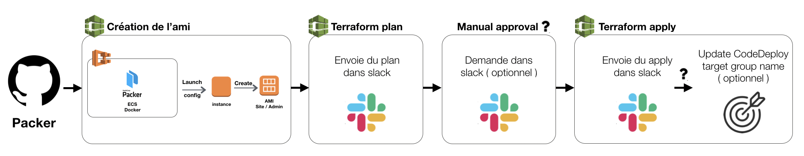

## Description



## Usage

### Use an existing environment

1. Clone this github repository:
```
$ git clone https://github.com/
$ cd workspaces-tf-advoko-deployments
```
2. Run `terraform workspace list` to see every existing environments.
3. Run `terraform workspace select environment-advoko-region` (ex: staging-advoko-eu-west-1)
4. Run `terraform plan` then `terraform apply`
5. This workspace works with [Atlantis](https://www.runatlantis.io/) as well.
6. If all the verifications have passed successfully, you can merge the PR

### Create a new environment
Every new workspace needs a new locals file with a specific structure, The name of the file is the same as the environment.

**IMPORTANT :** Every workspace has to be named as followed : environment-appname-region (ex: staging-advoko-eu-west-1)
The tags, naming of resources and region will be deduced by the workspace name.

1. Clone this github repository:
```
$ git clone https://github.com/kdesao-devops/School_project.git
$ cd workspaces-tf-advoko-deployment
```
2. Run `terraform workspace new env-appname-region` (ex: staging-advoko-eu-west-1)
3. Run `terraform plan` then `terraform apply`

https://www.terraform.io/docs/configuration-0-11/interpolation.html
